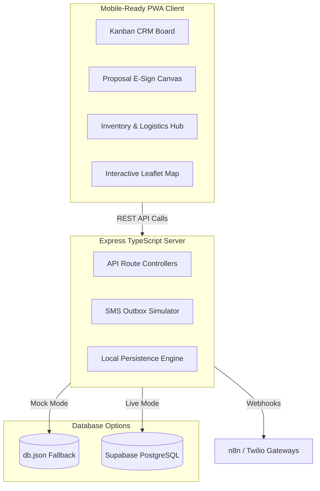

# Apex Climate & Solar: Full-Stack CRM & Logistics Engine

[](https://apex-portal-hq8m.onrender.com)
[](https://github.com/chirlebubblz/apex-portal)

An enterprise-grade, mobile-installable (PWA) sandbox application designed to orchestrate the end-to-end sales, e-signature, inventory management, and shipping logistics lifecycle for solar installation operations.

---

## 🚀 Key Highlights & Tech Stack

This project is a clean-architecture showcase of a full-stack Node.js + Express backend with a modern Vanilla CSS/JS frontend, designed to serve as a fully-functional portfolio project.

* **Backend Engine**: Node.js, Express, TypeScript (TS-Node compiler).
* **Database Layer**: Dual-mode data persistence:
  * **Production Mode**: Integrates directly with a remote **Supabase (PostgreSQL)** database with active Row Level Security (RLS) tables.
  * **Mock Mode (Local Fallback)**: Persistent file-writing database engine (`db.json`) allowing local state storage to survive server restarts.
* **Mobile Ready**: Built as a fully installable **Progressive Web App (PWA)** with a custom service-worker caching system and offline capabilities.
* **Frontend Visualization**: Leaflet.js interactive maps with custom dark-tiles, digital HTML5 signature canvas drawing pad, and dynamic CSS modals.
* **Integrations Sandbox**: Simulated webhook receivers verifying payloads for **n8n** automation nodes and **Twilio** SMS messaging triggers.
* **API Security Shields**: Built-in production-grade security:
  * **Rate Limiter**: Configures `express-rate-limit` on the public lead ingestion endpoint to prevent database spamming.
  * **XSS Sanitizer**: Global middleware to recursively strip HTML/Script tags from incoming request bodies.
  * **Authorization Middleware**: Optional environment-driven token validation (`API_SECRET_TOKEN`) to secure update and delete routes while keeping default sandbox mode open.

---

## 🗺️ System Architecture



---

## 🛠️ Database Schema

The database consists of three core tables (schema scripts located in `/supabase/migrations`):

### **1. `leads`**
Stores customer profiles, pricing information, pipeline stage, and signature image metadata.
* `id` (UUID, Primary Key)
* `full_name` (Text)
* `phone` (Text, normalized to E.164 standard)
* `email` (Text)
* `service_type` (Text)
* `monthly_bill` (Numeric)
* `pipeline_stage` (Text: `new`, `contacted`, `estimate_scheduled`, `closed_won`, `closed_lost`)
* `metadata` (JSONB: stores campaign info, custom variables, and e-signatures)

### **2. `inventory`**
Tracks solar equipment, stock levels, unit costs, and warehouses.
* `id` (UUID, Primary Key)
* `name` (Text)
* `sku` (Text, Unique)
* `category` (Text)
* `quantity` (Integer)
* `unit_cost` (Numeric)
* `currency` (Text)
* `warehouse_country` (Text: `PH`, `CN`, etc.)

### **3. `pipeline_logs`**
Maintains a full audit history of all CRM movements, SMS confirmations, and shipping updates.

---

## 📦 Local Setup & Installation

Follow these steps to run the application on your computer:

1. **Clone the Repository**:
   ```bash
   git clone https://github.com/chirlebubblz/apex-portal.git
   cd apex-portal
   ```
2. **Install Dependencies**:
   ```bash
   npm install
   ```
3. **Compile TypeScript**:
   ```bash
   npm run build
   ```
4. **Boot Up the App**:
   ```bash
   npm run dev
   ```
5. **Access Dashboard**:
   Open a browser and navigate to `http://localhost:3000`.

---

## ☁️ Cloud Deployment Configuration

### **Render (Web Service)**
This project is configured to run on Render's Free Web Service tier:
* **Build Command**: `npm install && npm run build`
* **Start Command**: `node dist/src/server.js`

### **Supabase (Live Database)**
To switch from local file mock persistence (`db.json`) to a live cloud database, configure these environment variables on Render:
* `SUPABASE_URL` = `<your-supabase-project-url>`
* `SUPABASE_ANON_KEY` = `<your-supabase-public-anon-key>`
* `MOCK_DB` = `false`
