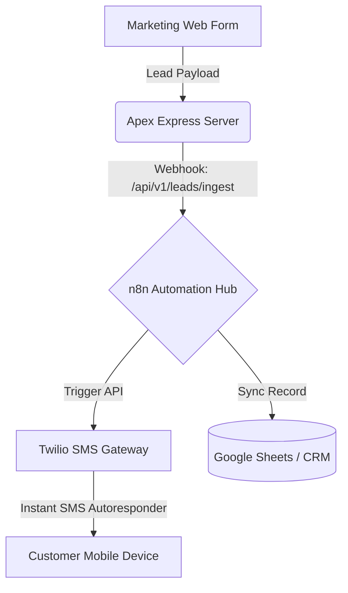

# Standard Operating Procedure (SOP): Apex CRM & Logistics Portal

> [!NOTE]
> **Prototype Status**: This application is a fully functional end-to-end sandbox prototype. External automation engines (n8n) and messaging gateways (Twilio) are simulated within the dashboard to demonstrate the integration architecture without requiring paid API accounts.

---

## 1. Executive Summary & Purpose
This document outlines the standard operational workflows for managing solar customer leads from initial contact to solar installation. The **Apex Portal** serves as the central control plane connecting sales operations, engineering surveys, customer communication, and equipment supply chains.

---

## 2. Lead Ingestion & Qualification
Leads enter the system through two main channels:
1. **Public API Ingestion**: Integrates with marketing funnels (e.g., Facebook Ads, website forms) via `POST /api/v1/leads/ingest`.
2. **Manual Directory Ingestion**: Sales operators add contacts directly via the dashboard using the **"+ Add Lead"** modal.

### **Ingestion Requirements**
* **Full Name**: Customer's contact name.
* **Phone Number**: Must be format-validated (e.g., `+1 555-019-9876` or `(555) 019-9234`). The backend automatically normalizes numbers to E.164 international format.
* **Service Type**: Classification of install (`solar`, `battery_storage`, `hybrid_system`, or `hvac_repair`).
* **Monthly Utility Bill**: Used by the proposal engine to calculate solar offset sizing.

---

## 3. CRM Pipeline & Stage Management
The sales representative moves leads through five sequential pipeline stages by dragging/dropping cards on the Kanban board or selecting stages in the details inspector:

| Stage Name | Operational Meaning | System Trigger / Event |
| :--- | :--- | :--- |
| `New` | Lead has entered the system. | Automated response SMS is simulated. |
| `Contacted` | Initial phone check or meeting completed. | Audit log record created. |
| `Estimate Scheduled` | Physical site surveyor assigned. | SMS slot confirmation sent. |
| `Closed Won` | Customer accepted and signed the contract. | Triggers inventory allocation. |
| `Closed Lost` | Deal canceled or customer opted out. | Opt-out log added. |

---

## 4. Interactive Proposal & Digital E-Signature
Once site surveys are completed, the sales representative generates a customized solar system agreement.

### **Steps for Generating and Signing Proposals:**
1. Open the lead details drawer and click **"Generate Proposal"**.
2. **Review offset calculations**: System automatically scales solar panel capacity and battery needs based on the lead's monthly bill.
3. **Capture Signature**: Have the client sign directly on the digital signature pad.
4. **Accept & Save**: Clicking **"Accept & Sign Proposal"** converts the canvas sketch to a Base64 image, updates the lead metadata (`metadata.signature`), transitions the stage to `Closed Won`, and closes the deal.
5. **Reopening**: Reopening the proposal draws the saved signature back onto the pad from database records.

---

## 5. Inventory Allocation & Shipping Logistics
When a lead is marked `Closed Won`, operators allocate hardware components to the installation.

### **Workflow for Supply Chain Dispatch:**
1. Navigate to the **Inventory & Logistics** tab.
2. Select **"Add Stock Item"** to register raw inventory (e.g. Panels, Inverters, Batteries) or edit existing stock.
3. Under the **Logistics Shipments** panel, select a pending lead, select the required hardware components (SKU), and enter the partner warehouse country.
4. Click **"Request Dispatch"**:
   * The system checks local warehouse stock.
   * If stock is available, it decreases the warehouse inventory level and creates a tracking shipment.
   * A shipment order is generated with a status of `pending_dispatch`.

### **Shipment Status Lifecycle:**
Operators update shipment statuses to keep the engineering teams updated in the field:
* **Pending Dispatch**: Material is being boxed.
* **In Transit**: Dispatched via carrier. Customer receives an automated SMS update with tracking ID.
* **Arrived**: Hardware package arrived at the regional hub (e.g. Philippines). Alert dispatched to local installer.
* **Installed**: System commissioned on-site. Completion email sent to customer.

---

## 6. Integration Architecture (n8n & Twilio)

The architecture is designed to utilize **n8n** and **Twilio** to automate workflows:

### **1. n8n (Automation Hub)**
* **Why it's needed**: To coordinate cross-platform actions. When a lead is ingested or changes stages, the Express server fires a webhook payload to n8n.
* **How it fits**: n8n intercepts the webhook and syncs the records to other tools (e.g., Google Sheets, Slack alerts, or Salesforce).
* **Current Sandbox Status**: The server simulates n8n receivers at `http://127.0.0.1:3000/api/v1/leads/mock-n8n-receiver` to verify payload formatting.

### **2. Twilio (SMS & Messaging Gateway)**
* **Why it's needed**: To deliver instant customer notifications (autoresponders, scheduling confirmations, shipment tracking updates) directly to mobile phones.
* **How it fits**: The backend triggers SMS payloads containing tracking numbers and surveyor slots.
* **Current Sandbox Status**: The app redirects outgoing text messages to a **Simulated Outbox Log** panel, allowing users to verify messaging triggers and copy in-flight texts without configuring credentials.
